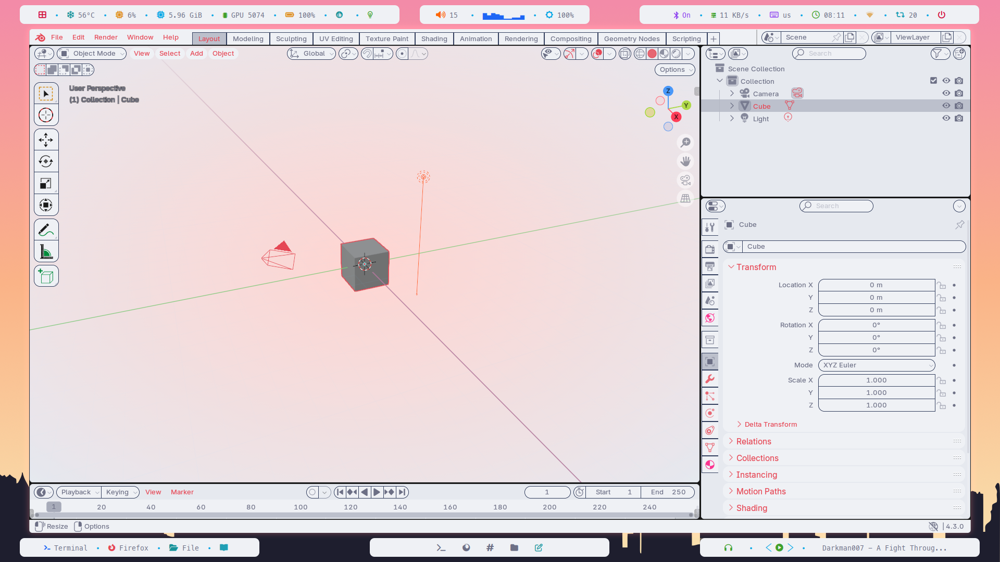

# Catppuccin_Blender

Темы Blender. Работают в версии 4.3 и ниже. 





Скопируйте темы в папку с вашим blender.

```python
mkdir /home/$USER/.config/blender/colorshemas/
git clone https://github.com/igorjoxa1118/Catppuccin_Blender.git
cp -r Catppuccin_Blender/* /home/$USER/.config/blender/colorshemas/
```

После этого вы сможете выбрать тему в вашей программе blender.